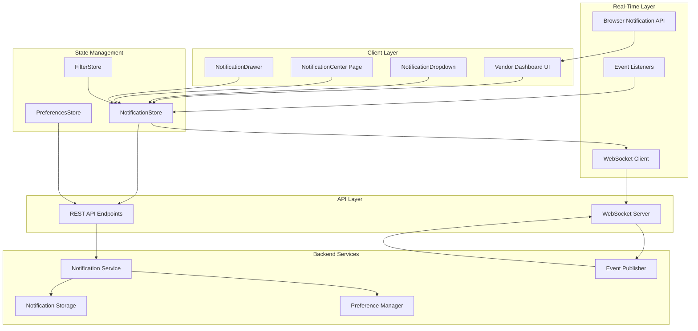
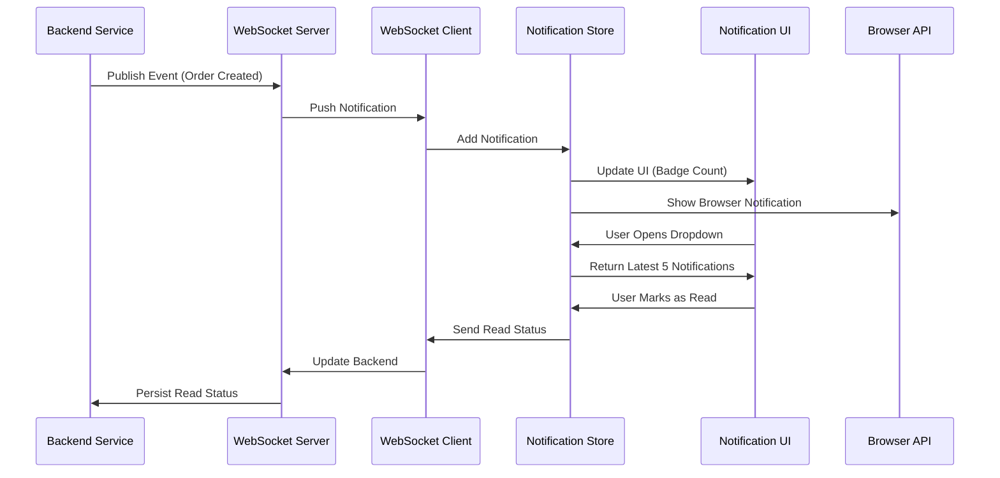
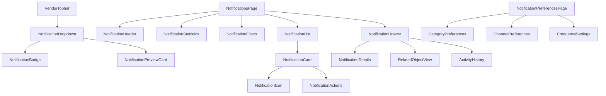

# Design Document: Vendor Notifications Center

## Overview

The Vendor Notifications Center is an enterprise-grade, real-time notification system for the AfriCart multi-vendor marketplace vendor dashboard. It provides comprehensive monitoring of store activities, alerts, and business events similar to Shopify Notifications and Amazon Seller Central Alerts. The system enables vendors to stay informed about critical business events across orders, products, inventory, customers, finance, marketing, and marketplace operations through a unified, real-time interface with advanced filtering, categorization, and action capabilities.

The system is designed to handle high-volume notification streams, provide instant updates via WebSocket connections, support granular notification preferences, and enable quick actions directly from notifications. It integrates seamlessly with the existing AfriCart vendor dashboard architecture while maintaining performance, accessibility, and security standards.

## Architecture

### System Architecture Diagram



### Notification Flow Sequence




## Components and Interfaces

### Component Hierarchy



### Core Type Definitions

```typescript
// Notification Categories
type NotificationCategory = 
  | "orders"
  | "products"
  | "inventory"
  | "customers"
  | "finance"
  | "marketing"
  | "marketplace";

// Notification Priority Levels
type NotificationPriority = "low" | "normal" | "high" | "urgent";


// Notification Status
type NotificationStatus = "unread" | "read" | "archived";

// Notification Action Types
type NotificationActionType =
  | "view_order"
  | "restock_product"
  | "reply_review"
  | "view_payment"
  | "view_campaign"
  | "view_customer"
  | "read_announcement";

// Base Notification Interface
interface Notification {
  id: string;
  vendorId: string;
  category: NotificationCategory;
  type: string;
  title: string;
  message: string;
  priority: NotificationPriority;
  status: NotificationStatus;
  isImportant: boolean;
  metadata: Record<string, any>;
  relatedObjectId?: string;
  relatedObjectType?: string;
  actionType?: NotificationActionType;
  actionUrl?: string;
  createdAt: Date;
  readAt?: Date;
  archivedAt?: Date;
}

// Notification Statistics
interface NotificationStats {
  total: number;
  unread: number;
  important: number;
  byCategory: Record<NotificationCategory, number>;
  todayCount: number;
  weekCount: number;
}


// Filter Options
interface NotificationFilters {
  categories: NotificationCategory[];
  status: NotificationStatus | "all";
  priority: NotificationPriority | "all";
  dateRange: {
    start: Date | null;
    end: Date | null;
  } | "today" | "week" | "month" | "all";
  searchQuery: string;
  isImportantOnly: boolean;
}

// Notification Preferences
interface NotificationPreferences {
  vendorId: string;
  emailEnabled: boolean;
  smsEnabled: boolean;
  pushEnabled: boolean;
  soundEnabled: boolean;
  frequency: "immediate" | "daily" | "weekly";
  categories: {
    [K in NotificationCategory]: {
      enabled: boolean;
      email: boolean;
      sms: boolean;
      push: boolean;
    };
  };
}

// WebSocket Message Types
interface WebSocketMessage {
  type: "notification" | "ping" | "ack" | "error";
  payload: Notification | { message: string };
  timestamp: Date;
}
```


### Component 1: NotificationBadge

**Purpose**: Displays unread notification count in the top navigation bar

**Interface**:
```typescript
interface NotificationBadgeProps {
  count: number;
  maxDisplay?: number; // Default: 99
  variant?: "dot" | "count";
  pulse?: boolean; // Animate when new notification arrives
}
```

**Responsibilities**:
- Display unread notification count
- Show pulsing animation for new notifications
- Handle overflow display (e.g., "99+")
- Provide visual indicator for notification presence

**Rendering Logic**:
- If count = 0: Hide badge
- If count > 0 and count <= maxDisplay: Show count
- If count > maxDisplay: Show "{maxDisplay}+"
- If variant = "dot": Show red dot without count

### Component 2: NotificationDropdown

**Purpose**: Quick preview of latest notifications in header dropdown

**Interface**:
```typescript
interface NotificationDropdownProps {
  isOpen: boolean;
  onClose: () => void;
  onViewAll: () => void;
}
```

**Responsibilities**:
- Display latest 5 notifications
- Show notification badge count
- Provide "View All" navigation
- Handle quick actions (mark as read)
- Auto-close on outside click
- Keyboard navigation support


### Component 3: NotificationHeader

**Purpose**: Page header with title, description, and quick actions

**Interface**:
```typescript
interface NotificationHeaderProps {
  stats: NotificationStats;
  onMarkAllRead: () => void;
  onClearAll: () => void;
}
```

**Responsibilities**:
- Display page title and description
- Show bulk action buttons
- Provide settings navigation
- Display loading states

### Component 4: NotificationStatistics

**Purpose**: Dashboard showing notification metrics and counts

**Interface**:
```typescript
interface NotificationStatisticsProps {
  stats: NotificationStats;
  onCategoryClick?: (category: NotificationCategory) => void;
}
```

**Responsibilities**:
- Display total, unread, and important counts
- Show breakdown by category
- Visualize trends with mini charts
- Make categories clickable for filtering
- Update in real-time


### Component 5: NotificationFilters

**Purpose**: Advanced filtering UI for notification list

**Interface**:
```typescript
interface NotificationFiltersProps {
  filters: NotificationFilters;
  onChange: (filters: NotificationFilters) => void;
  onReset: () => void;
}
```

**Responsibilities**:
- Provide category filter checkboxes
- Status filter dropdown (All, Unread, Read, Important)
- Date range picker with presets
- Search input with debouncing
- Clear filters button
- Show active filter count

### Component 6: NotificationList

**Purpose**: Main list view with infinite scrolling

**Interface**:
```typescript
interface NotificationListProps {
  notifications: Notification[];
  isLoading: boolean;
  hasMore: boolean;
  onLoadMore: () => void;
  onNotificationClick: (notification: Notification) => void;
  onMarkAsRead: (id: string) => void;
  onArchive: (id: string) => void;
}
```

**Responsibilities**:
- Render notification cards in list
- Implement infinite scrolling
- Show loading skeletons
- Handle empty states
- Manage selection states
- Support bulk actions
- Virtual scrolling for performance


### Component 7: NotificationCard

**Purpose**: Individual notification item display

**Interface**:
```typescript
interface NotificationCardProps {
  notification: Notification;
  onClick: () => void;
  onMarkAsRead: () => void;
  onArchive: () => void;
  isSelected?: boolean;
}
```

**Responsibilities**:
- Display icon based on category
- Show title, message, and timestamp
- Visual indicator for read/unread status
- Category badge display
- Priority indicator (urgent = red border)
- Action buttons on hover
- Keyboard accessibility

### Component 8: NotificationDrawer

**Purpose**: Slide-out panel for detailed notification view

**Interface**:
```typescript
interface NotificationDrawerProps {
  notification: Notification | null;
  isOpen: boolean;
  onClose: () => void;
  onAction: (actionType: NotificationActionType) => void;
}
```

**Responsibilities**:
- Display full notification details
- Show related object information
- Activity history timeline
- Action buttons specific to notification type
- Close on ESC key
- Slide-in animation from right


### Component 9: NotificationPreferences

**Purpose**: Settings page for notification preferences

**Interface**:
```typescript
interface NotificationPreferencesProps {
  preferences: NotificationPreferences;
  onChange: (preferences: NotificationPreferences) => void;
  onSave: () => void;
}
```

**Responsibilities**:
- Toggle email/SMS/push notifications
- Per-category channel preferences
- Frequency settings
- Sound alert toggle
- Test notification button
- Save and reset functionality

## Data Models

### Notification Entity

```typescript
interface Notification {
  // Identity
  id: string;                           // UUID
  vendorId: string;                     // Vendor who receives this
  
  // Classification
  category: NotificationCategory;       // Primary category
  type: string;                         // Specific event type (e.g., "order.created")
  priority: NotificationPriority;       // Importance level
  
  // Content
  title: string;                        // Short headline (max 100 chars)
  message: string;                      // Detailed message (max 500 chars)
  metadata: Record<string, any>;        // Additional data
  
  // Status
  status: NotificationStatus;           // Read/unread/archived
  isImportant: boolean;                 // Starred/flagged
  
  // Relations
  relatedObjectId?: string;             // ID of related entity
  relatedObjectType?: string;           // Type (order, product, etc.)
  
  // Actions
  actionType?: NotificationActionType;  // Primary action
  actionUrl?: string;                   // Navigation URL
  
  // Timestamps
  createdAt: Date;
  readAt?: Date;
  archivedAt?: Date;
}
```


**Validation Rules**:
- `id` must be valid UUID v4
- `vendorId` must reference existing vendor
- `title` length: 1-100 characters
- `message` length: 1-500 characters
- `category` must be one of predefined categories
- `type` format: "{category}.{action}" (e.g., "orders.created")
- `createdAt` cannot be in the future
- `readAt` must be after `createdAt` if present
- `archivedAt` must be after `createdAt` if present

### NotificationPreferences Entity

```typescript
interface NotificationPreferences {
  vendorId: string;                     // Primary key
  
  // Global settings
  emailEnabled: boolean;
  smsEnabled: boolean;
  pushEnabled: boolean;
  soundEnabled: boolean;
  
  // Delivery frequency
  frequency: "immediate" | "daily" | "weekly";
  
  // Category-specific settings
  categories: {
    orders: CategoryChannelSettings;
    products: CategoryChannelSettings;
    inventory: CategoryChannelSettings;
    customers: CategoryChannelSettings;
    finance: CategoryChannelSettings;
    marketing: CategoryChannelSettings;
    marketplace: CategoryChannelSettings;
  };
  
  // Metadata
  updatedAt: Date;
}

interface CategoryChannelSettings {
  enabled: boolean;
  email: boolean;
  sms: boolean;
  push: boolean;
}
```


**Validation Rules**:
- All boolean flags default to `true` except `smsEnabled` (false)
- `frequency` defaults to "immediate"
- Each category must have all four channel settings defined
- If category.enabled = false, all channels for that category ignored

### Notification Type Definitions

```typescript
// Orders Category
type OrderNotificationType =
  | "order.created"
  | "order.cancelled"
  | "order.returned"
  | "order.delivered"
  | "order.payment_received"
  | "order.refund_requested";

// Products Category
type ProductNotificationType =
  | "product.approved"
  | "product.rejected"
  | "product.updated"
  | "product.removed"
  | "product.out_of_stock";

// Inventory Category
type InventoryNotificationType =
  | "inventory.low_stock"
  | "inventory.out_of_stock"
  | "inventory.adjustment_required"
  | "inventory.restock_reminder";

// Customers Category
type CustomerNotificationType =
  | "customer.message"
  | "customer.review"
  | "customer.complaint"
  | "customer.question";

// Finance Category
type FinanceNotificationType =
  | "finance.payment_received"
  | "finance.payout_processed"
  | "finance.refund_issued"
  | "finance.withdrawal_completed"
  | "finance.commission_deducted";


// Marketing Category
type MarketingNotificationType =
  | "marketing.campaign_started"
  | "marketing.campaign_ended"
  | "marketing.coupon_expiring"
  | "marketing.promotion_approved"
  | "marketing.promotion_rejected";

// Marketplace Category
type MarketplaceNotificationType =
  | "marketplace.policy_update"
  | "marketplace.maintenance_scheduled"
  | "marketplace.announcement"
  | "marketplace.performance_alert"
  | "marketplace.verification_required";
```

## Algorithmic Pseudocode

### Main Notification Processing Algorithm

```typescript
/**
 * Main algorithm for processing incoming notifications
 * @precondition: WebSocket connection is established and authenticated
 * @postcondition: Notification is stored, UI updated, and preference-based actions triggered
 */
function processIncomingNotification(message: WebSocketMessage): void {
  // Validate message structure
  if (!isValidWebSocketMessage(message)) {
    logError("Invalid WebSocket message format");
    return;
  }
  
  const notification = message.payload as Notification;
  
  // Validate notification data
  if (!validateNotification(notification)) {
    logError("Invalid notification data", notification);
    return;
  }
  
  // Check if notification belongs to current vendor
  if (notification.vendorId !== getCurrentVendorId()) {
    logError("Notification vendor mismatch");
    return;
  }

  
  // Add to notification store
  addNotificationToStore(notification);
  
  // Update statistics
  updateNotificationStats(notification);
  
  // Get user preferences
  const preferences = getNotificationPreferences();
  
  // Check if category is enabled
  const categorySettings = preferences.categories[notification.category];
  if (!categorySettings.enabled) {
    return; // User disabled this category
  }
  
  // Trigger browser notification if enabled
  if (preferences.pushEnabled && categorySettings.push) {
    showBrowserNotification(notification);
  }
  
  // Play sound if enabled
  if (preferences.soundEnabled) {
    playNotificationSound(notification.priority);
  }
  
  // Update UI badge count
  updateBadgeCount();
  
  // Send acknowledgment to server
  sendWebSocketAck(notification.id);
}
```

**Preconditions**:
- WebSocket connection is active and authenticated
- Vendor session is valid
- Notification preferences are loaded

**Postconditions**:
- Notification is stored in local state
- UI is updated with new notification
- Browser notification shown if enabled
- Statistics are updated
- Server receives acknowledgment


### Notification Filtering Algorithm

```typescript
/**
 * Filters notifications based on user-selected criteria
 * @precondition: notifications array is not null, filters object is valid
 * @postcondition: returns filtered array matching all filter criteria
 */
function filterNotifications(
  notifications: Notification[],
  filters: NotificationFilters
): Notification[] {
  let result = [...notifications];
  
  // Filter by categories
  if (filters.categories.length > 0) {
    result = result.filter(n => filters.categories.includes(n.category));
  }
  
  // Filter by status
  if (filters.status !== "all") {
    result = result.filter(n => n.status === filters.status);
  }
  
  // Filter by priority
  if (filters.priority !== "all") {
    result = result.filter(n => n.priority === filters.priority);
  }
  
  // Filter by important flag
  if (filters.isImportantOnly) {
    result = result.filter(n => n.isImportant === true);
  }
  
  // Filter by date range
  if (filters.dateRange !== "all") {
    const now = new Date();
    let startDate: Date;
    
    if (filters.dateRange === "today") {
      startDate = new Date(now.getFullYear(), now.getMonth(), now.getDate());
    } else if (filters.dateRange === "week") {
      startDate = new Date(now.getTime() - 7 * 24 * 60 * 60 * 1000);
    } else if (filters.dateRange === "month") {
      startDate = new Date(now.getFullYear(), now.getMonth(), 1);
    } else {
      // Custom date range
      startDate = filters.dateRange.start || new Date(0);
      const endDate = filters.dateRange.end || now;
      result = result.filter(n => 
        n.createdAt >= startDate && n.createdAt <= endDate
      );
      return result;
    }
    
    result = result.filter(n => n.createdAt >= startDate);
  }

  
  // Filter by search query
  if (filters.searchQuery.trim() !== "") {
    const query = filters.searchQuery.toLowerCase();
    result = result.filter(n =>
      n.title.toLowerCase().includes(query) ||
      n.message.toLowerCase().includes(query)
    );
  }
  
  return result;
}
```

**Preconditions**:
- `notifications` is a valid array (may be empty)
- `filters` object contains all required fields
- Date objects in filters are valid

**Postconditions**:
- Returns new array (does not mutate input)
- All items in result match ALL filter criteria (AND logic)
- Empty array if no notifications match
- Original order preserved

**Loop Invariants**:
- Each filtering step maintains a valid notification array
- No notification is added during filtering
- Result array size is monotonically non-increasing

### Notification Sorting Algorithm

```typescript
/**
 * Sorts notifications by priority and timestamp
 * @precondition: notifications array contains valid Notification objects
 * @postcondition: returns sorted array with urgent first, then by newest
 */
function sortNotifications(notifications: Notification[]): Notification[] {
  const priorityWeight: Record<NotificationPriority, number> = {
    urgent: 4,
    high: 3,
    normal: 2,
    low: 1,
  };
  
  return [...notifications].sort((a, b) => {
    // First sort by priority (urgent first)
    const priorityDiff = priorityWeight[b.priority] - priorityWeight[a.priority];
    if (priorityDiff !== 0) {
      return priorityDiff;
    }
    
    // Then by timestamp (newest first)
    return b.createdAt.getTime() - a.createdAt.getTime();
  });
}
```


**Preconditions**:
- `notifications` is a valid array of Notification objects
- Each notification has valid `priority` and `createdAt` values

**Postconditions**:
- Returns new sorted array (immutable)
- Urgent notifications appear first
- Within same priority, newer notifications appear first
- Original array is not modified

### WebSocket Connection Management

```typescript
/**
 * Manages WebSocket connection lifecycle with reconnection logic
 * @precondition: vendorId and authToken are valid
 * @postcondition: WebSocket connection established or reconnection scheduled
 */
function initializeWebSocketConnection(
  vendorId: string,
  authToken: string
): void {
  let reconnectAttempts = 0;
  const maxReconnectAttempts = 5;
  const reconnectDelay = 3000; // 3 seconds
  
  function connect(): void {
    const ws = new WebSocket(`wss://api.africart.com/notifications?vendorId=${vendorId}`);
    
    ws.onopen = () => {
      console.log("WebSocket connected");
      reconnectAttempts = 0;
      
      // Send authentication
      ws.send(JSON.stringify({
        type: "auth",
        token: authToken,
      }));
    };
    
    ws.onmessage = (event: MessageEvent) => {
      const message: WebSocketMessage = JSON.parse(event.data);
      processIncomingNotification(message);
    };
    
    ws.onerror = (error: Event) => {
      console.error("WebSocket error:", error);
    };

    
    ws.onclose = () => {
      console.log("WebSocket disconnected");
      
      // Attempt reconnection with exponential backoff
      if (reconnectAttempts < maxReconnectAttempts) {
        reconnectAttempts++;
        const delay = reconnectDelay * Math.pow(2, reconnectAttempts - 1);
        
        console.log(`Reconnecting in ${delay}ms (attempt ${reconnectAttempts})`);
        setTimeout(connect, delay);
      } else {
        console.error("Max reconnection attempts reached");
        showConnectionErrorUI();
      }
    };
    
    // Store WebSocket instance for cleanup
    setWebSocketInstance(ws);
  }
  
  connect();
}
```

**Preconditions**:
- `vendorId` is a valid UUID
- `authToken` is a valid JWT token
- Browser supports WebSocket API

**Postconditions**:
- WebSocket connection is established
- Event handlers are registered
- Authentication message sent
- Reconnection logic is active

**Loop Invariants**:
- Reconnect attempts never exceed maxReconnectAttempts
- Delay increases exponentially with each attempt
- Only one active WebSocket connection exists at a time

## Key Functions with Formal Specifications

### Function 1: addNotificationToStore()

```typescript
function addNotificationToStore(notification: Notification): void
```

**Preconditions**:
- `notification` is a valid Notification object
- `notification.id` is unique (not already in store)
- `notification.vendorId` matches current vendor

**Postconditions**:
- Notification is added to the beginning of the store array
- Store is sorted by priority and timestamp
- UI subscribers are notified of change
- Badge count is updated


### Function 2: markAsRead()

```typescript
function markAsRead(notificationId: string): Promise<void>
```

**Preconditions**:
- `notificationId` exists in store
- Notification is currently unread (status = "unread")
- Network connection is available

**Postconditions**:
- Notification status updated to "read"
- `readAt` timestamp set to current time
- Backend API called to persist change
- Badge count decremented
- UI updated to reflect read state

### Function 3: archiveNotification()

```typescript
function archiveNotification(notificationId: string): Promise<void>
```

**Preconditions**:
- `notificationId` exists in store
- Notification is not already archived

**Postconditions**:
- Notification status updated to "archived"
- `archivedAt` timestamp set to current time
- Notification removed from main list view
- Backend API called to persist change
- Statistics updated

### Function 4: bulkMarkAsRead()

```typescript
function bulkMarkAsRead(notificationIds: string[]): Promise<void>
```

**Preconditions**:
- `notificationIds` array is not empty
- All IDs exist in store
- Network connection is available

**Postconditions**:
- All specified notifications marked as read
- `readAt` timestamp set for all
- Single batch API call made
- Badge count updated to reflect changes
- UI updated efficiently (single re-render)


### Function 5: fetchNotifications()

```typescript
function fetchNotifications(
  page: number,
  limit: number,
  filters: NotificationFilters
): Promise<{ notifications: Notification[]; hasMore: boolean }>
```

**Preconditions**:
- `page` >= 1
- `limit` > 0 and <= 100
- `filters` object is valid
- User is authenticated

**Postconditions**:
- Returns array of notifications for requested page
- `hasMore` indicates if more notifications exist
- Notifications are sorted by priority and timestamp
- Filters are applied on server-side
- Cache is updated with fetched data

**Loop Invariants**: N/A (no loops in function body)

### Function 6: showBrowserNotification()

```typescript
function showBrowserNotification(notification: Notification): void
```

**Preconditions**:
- Browser supports Notification API
- User has granted notification permission
- Notification priority is "high" or "urgent"
- Tab is not currently focused

**Postconditions**:
- Browser notification displayed with title and body
- Notification icon matches category
- Click handler navigates to notification detail
- Notification auto-closes after 5 seconds
- Sound played if enabled

## Example Usage

### Example 1: Complete Notification Flow

```typescript
// 1. Initialize WebSocket connection on vendor dashboard mount
useEffect(() => {
  const vendorId = getCurrentVendorId();
  const authToken = getAuthToken();
  
  initializeWebSocketConnection(vendorId, authToken);
  
  return () => {
    // Cleanup on unmount
    closeWebSocketConnection();
  };
}, []);
```


### Example 2: Fetching and Filtering Notifications

```typescript
// Notification Center Page Component
function NotificationCenterPage() {
  const [notifications, setNotifications] = useState<Notification[]>([]);
  const [filters, setFilters] = useState<NotificationFilters>({
    categories: [],
    status: "all",
    priority: "all",
    dateRange: "all",
    searchQuery: "",
    isImportantOnly: false,
  });
  const [page, setPage] = useState(1);
  const [hasMore, setHasMore] = useState(true);
  const [isLoading, setIsLoading] = useState(false);
  
  // Fetch notifications on mount and filter change
  useEffect(() => {
    async function loadNotifications() {
      setIsLoading(true);
      const result = await fetchNotifications(page, 20, filters);
      setNotifications(result.notifications);
      setHasMore(result.hasMore);
      setIsLoading(false);
    }
    
    loadNotifications();
  }, [page, filters]);
  
  // Load more handler for infinite scroll
  const handleLoadMore = () => {
    if (hasMore && !isLoading) {
      setPage(prev => prev + 1);
    }
  };
  
  // Filter change handler
  const handleFilterChange = (newFilters: NotificationFilters) => {
    setFilters(newFilters);
    setPage(1); // Reset to first page
  };
  
  return (
    <div className="notification-center">
      <NotificationHeader />
      <NotificationStatistics />
      <NotificationFilters filters={filters} onChange={handleFilterChange} />
      <NotificationList
        notifications={notifications}
        isLoading={isLoading}
        hasMore={hasMore}
        onLoadMore={handleLoadMore}
      />
    </div>
  );
}
```


### Example 3: Handling Notification Actions

```typescript
// Notification action dispatcher
function handleNotificationAction(
  notification: Notification,
  actionType: NotificationActionType
) {
  // Mark as read first
  markAsRead(notification.id);
  
  // Route based on action type
  switch (actionType) {
    case "view_order":
      router.push(`/vendor/orders/${notification.relatedObjectId}`);
      break;
      
    case "restock_product":
      router.push(`/vendor/inventory?productId=${notification.relatedObjectId}`);
      break;
      
    case "reply_review":
      router.push(`/vendor/reviews/${notification.relatedObjectId}`);
      break;
      
    case "view_payment":
      router.push(`/vendor/finance/transactions/${notification.relatedObjectId}`);
      break;
      
    case "view_campaign":
      router.push(`/vendor/marketing/campaigns/${notification.relatedObjectId}`);
      break;
      
    case "view_customer":
      router.push(`/vendor/customers/${notification.relatedObjectId}`);
      break;
      
    case "read_announcement":
      // Open drawer with full announcement
      openNotificationDrawer(notification);
      break;
      
    default:
      console.warn("Unknown action type:", actionType);
  }
}
```

### Example 4: Real-Time Badge Update

```typescript
// Custom hook for notification badge
function useNotificationBadge() {
  const [unreadCount, setUnreadCount] = useState(0);
  
  useEffect(() => {
    // Subscribe to notification store
    const unsubscribe = notificationStore.subscribe((state) => {
      const count = state.notifications.filter(n => n.status === "unread").length;
      setUnreadCount(count);
    });
    
    return unsubscribe;
  }, []);
  
  return unreadCount;
}
```


// Usage in Topbar
function VendorTopbar() {
  const unreadCount = useNotificationBadge();
  
  return (
    <header>
      <button onClick={openNotificationDropdown}>
        <Bell />
        <NotificationBadge count={unreadCount} />
      </button>
    </header>
  );
}
```

### Example 5: Managing Notification Preferences

```typescript
// Preferences management
async function updateNotificationPreferences(
  category: NotificationCategory,
  channel: "email" | "sms" | "push",
  enabled: boolean
) {
  // Get current preferences
  const preferences = await getNotificationPreferences();
  
  // Update specific category channel
  preferences.categories[category][channel] = enabled;
  
  // Save to backend
  await saveNotificationPreferences(preferences);
  
  // Update local state
  updatePreferencesStore(preferences);
  
  // Show success message
  showToast("Preferences updated successfully");
}

// Usage in preferences page
function NotificationPreferencesPage() {
  const [preferences, setPreferences] = useState<NotificationPreferences>();
  
  const handleToggle = (
    category: NotificationCategory,
    channel: "email" | "sms" | "push"
  ) => {
    const currentValue = preferences?.categories[category][channel];
    updateNotificationPreferences(category, channel, !currentValue);
  };
  
  return (
    <div>
      <h2>Email Notifications</h2>
      {Object.keys(preferences.categories).map(category => (
        <label key={category}>
          <input
            type="checkbox"
            checked={preferences.categories[category].email}
            onChange={() => handleToggle(category, "email")}
          />
          {category}
        </label>
      ))}
    </div>
  );
}
```


## Correctness Properties

### Universal Invariants

The following properties must hold at all times throughout the system:

**Property 1: Notification Uniqueness**
```typescript
∀ notifications: Notification[], i, j ∈ [0, notifications.length)
  where i ≠ j ⟹ notifications[i].id ≠ notifications[j].id
```
*No two notifications in the store can have the same ID*

**Property 2: Vendor Isolation**
```typescript
∀ notification ∈ NotificationStore
  ⟹ notification.vendorId = getCurrentVendorId()
```
*All notifications in the store belong to the current vendor*

**Property 3: Status Consistency**
```typescript
∀ notification ∈ Notifications
  (notification.status = "read" ⟹ notification.readAt ≠ null) ∧
  (notification.status = "archived" ⟹ notification.archivedAt ≠ null)
```
*Read/archived notifications must have corresponding timestamps*

**Property 4: Timestamp Ordering**
```typescript
∀ notification ∈ Notifications
  notification.readAt ≠ null ⟹ notification.readAt >= notification.createdAt ∧
  notification.archivedAt ≠ null ⟹ notification.archivedAt >= notification.createdAt
```
*Action timestamps cannot precede creation timestamp*

**Property 5: Filter Correctness**
```typescript
∀ notification ∈ filterNotifications(notifications, filters)
  ⟹ matchesAllFilters(notification, filters) = true
```
*All filtered notifications match ALL active filter criteria*

**Property 6: Badge Count Accuracy**
```typescript
badgeCount = |{n ∈ NotificationStore | n.status = "unread"}|
```
*Badge count always equals the number of unread notifications*


**Property 7: Sort Order Consistency**
```typescript
∀ notifications ∈ sortNotifications(input)
  ∀ i, j ∈ [0, notifications.length) where i < j
    ⟹ (priority(notifications[i]) >= priority(notifications[j])) ∧
       (priority(notifications[i]) = priority(notifications[j])
        ⟹ notifications[i].createdAt >= notifications[j].createdAt)
```
*Sorted notifications maintain priority-then-timestamp order*

**Property 8: WebSocket Single Connection**
```typescript
∀ time t, |activeWebSocketConnections| ≤ 1
```
*At most one active WebSocket connection exists per vendor session*

**Property 9: Category Preference Enforcement**
```typescript
∀ notification ∈ displayedNotifications,
  preferences.categories[notification.category].enabled = true
```
*Only notifications from enabled categories are displayed*

**Property 10: Idempotent Operations**
```typescript
∀ notificationId, 
  markAsRead(markAsRead(notificationId)) ≡ markAsRead(notificationId) ∧
  archive(archive(notificationId)) ≡ archive(notificationId)
```
*Marking as read or archiving twice has same effect as once*

## Error Handling

### Error Scenario 1: WebSocket Connection Failure

**Condition**: Network interruption or server unavailable during WebSocket connection

**Response**:
- Display inline warning banner: "Real-time updates temporarily unavailable"
- Attempt automatic reconnection with exponential backoff (3s, 6s, 12s, 24s, 48s)
- Fall back to polling every 30 seconds
- Show reconnection status in UI

**Recovery**:
- On successful reconnection, fetch missed notifications via REST API
- Merge new notifications with existing store
- Remove warning banner
- Resume WebSocket listening


### Error Scenario 2: API Request Timeout

**Condition**: REST API request (mark as read, fetch notifications) times out after 10 seconds

**Response**:
- Show error toast: "Request timed out. Please try again."
- Revert optimistic UI updates
- Log error details for debugging
- Retry button in toast notification

**Recovery**:
- User clicks retry button
- Exponential backoff for automatic retries (max 3 attempts)
- If all retries fail, show persistent error message
- Allow user to continue with offline mode (read-only)

### Error Scenario 3: Invalid Notification Data

**Condition**: Received notification from WebSocket fails validation

**Response**:
- Log error with notification details
- Send error report to monitoring service
- Skip displaying the notification
- Do not crash the application
- Continue processing subsequent notifications

**Recovery**:
- Backend team alerted via monitoring
- User unaffected (no visible error)
- Next valid notification displayed normally

### Error Scenario 4: Browser Notification Permission Denied

**Condition**: User denies browser notification permission

**Response**:
- Display informational message: "Enable browser notifications in settings to receive alerts"
- Provide "How to enable" link
- Continue showing in-app notifications
- Disable browser notification toggle in preferences

**Recovery**:
- User can manually enable in browser settings
- App detects permission change and re-enables feature
- Show success message when permission granted


### Error Scenario 5: Infinite Scroll Load Failure

**Condition**: Fetching next page of notifications fails

**Response**:
- Show error message at bottom of list: "Failed to load more notifications"
- Provide "Try Again" button
- Maintain current list (don't clear existing notifications)
- Disable infinite scroll trigger temporarily

**Recovery**:
- User clicks "Try Again" button
- Retry same page request
- On success, append notifications and resume infinite scroll
- On repeated failure, suggest page refresh

### Error Scenario 6: Stale Data Detection

**Condition**: Client-side notification data older than 5 minutes compared to server

**Response**:
- Show warning: "Your notifications may be outdated"
- Provide "Refresh" button
- Automatically refresh on next user interaction
- Log sync discrepancy

**Recovery**:
- Fetch latest notifications from server
- Replace entire local store with fresh data
- Update all UI components
- Resume normal operation

## Testing Strategy

### Unit Testing Approach

**Test Coverage Goals**: 80% code coverage minimum

**Key Test Cases**:

1. **Notification Store Operations**
   - Adding notifications maintains uniqueness
   - Marking as read updates status and timestamp
   - Archiving removes from main list
   - Bulk operations handle empty arrays
   - Store subscriber notifications fired correctly

2. **Filtering Logic**
   - Category filter includes only selected categories
   - Status filter correctly filters read/unread/archived
   - Date range filters use correct boundaries
   - Search query matches title and message
   - Combined filters use AND logic
   - Empty filters return all notifications
